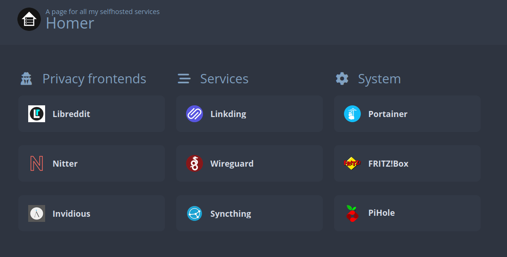

# Home selfhosting using Ansible

This is the setup I use for selfhosting my favourite services on my home server.



## Getting Started

To get started with this project, clone the repository.
Then you'll need a Debian 11 system with SSH access configured.

## Prerequisites

- Debian 11 (for the server)
- Ansible >2.14 (on your machine)

## Requirements

Install the required Ansible collection using the following command

```bash
ansible-galaxy install -r requirements.yml
```

## Deployment

To run the Ansible Playbook on your server run the following commmand:

```bash
ansible-playbook run.yml -i inventory
```

Where `inventory` contains your host configuration, see `inventory.example` for a sample configuration.

## Included services

### Frontends

- [Libreddit](https://github.com/libreddit/libreddit) (Private front-end for Reddit)
- [Nitter](https://github.com/zedeus/nitter) (Alternative Twitter front-end)
- [Invidious](https://github.com/iv-org/invidious) (Invidious is an alternative front-end to YouTube)

### Services

- [Linkding](https://github.com/sissbruecker/linkding) (Self-hosted bookmark service)
- [Wireguard UI](https://github.com/ngoduykhanh/wireguard-ui) (Wireguard web interface)
- [Syncthing](https://github.com/syncthing/syncthing) (Open Source Continuous File Synchronization)

### System

- [Portainer](https://github.com/portainer/portainer) (Making Docker and Kubernetes management easy)

### Port mappings

| Name         | Category | Ext port | Int port |
| ------------ | -------- | -------- | -------- |
| Libreddit    | frontend | 2000     | 8080     |
| Nitter       | frontend | 2001     | 8080     |
| Invidious    | frontend | 2002     | 3000     |
| Chatbot-ui   | frontend | 2003     | 3000     |
| Linkding     | Services | 3000     | 9090     |
| Wireguard-ui | Services | 3001     | 5000     |
| Syncthing    | Services | 8384     | 8384     |
| Portainer    | System   | 4000     | 9000     |

## Security

This configuration is intended to be used within your local network or via a Wireguard VPN connection.
The secure HTTPS protocol is not currently used, so it is strongly discouraged to expose the ports of services on the Internet, because all traffic will be sent unencrypted.

## Hardware

The hardware I use is a Fujitsu Futro S920, with the following configuration:

- CPU: AMD GX-415GA SOC (4 core) @ 1.5GHz
- RAM: 4GB DDR3
- SSD: 120GB Crucial mSata

## Acknowledgments

Thanks to [@notthebee](https://github.com/notthebee) for inspiring me with his [video](https://www.youtube.com/watch?v=f5jNJDaztqk).